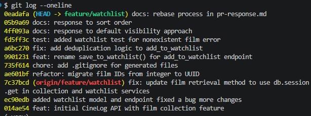

# PR Response Doc — CineLog Watchlist Feature

## AI Usage
<!-- Fill in at the end — how you used AI tools during this project. Could be: codebase orientation, understanding a pattern, stress-testing a design argument, verifying commit format, or another legitimate use. If you didn't use AI at any point, write a brief note saying so and what you relied on instead. If you used AI when drafting your Comment 4 or Comment 5 responses, describe what you asked and how your final argument differs from or builds on what the AI returned.-->
<!-- Describe at least 2 specific instances where you used an AI tool during this project. 
     For each: what did you give the AI as input, what did it produce, and what did you
     change, override, or direct differently?

     "I used Claude to help me code" is not sufficient.
     "I gave Claude my X section from planning.md and asked it to implement
     function(). It returned a function using Y. I overrode the
     Z because AA" -->

**Instance 1**:

- *What I gave the AI:* A draft of my Comment 5 answer about watchlist sort order, with the prompt: "What counterargument would a careful code reviewer raise against this position? What tradeoff am I not acknowledging?"
- *What it produced:* A reviewer counterargument that alphabetical order treats the watchlist like a reference index instead of a personal queue, and that the tradeoff is ignoring recency/priority.
- *What I changed or overrode:* I revised my final response to explicitly acknowledge that date-added is a valid personal-queue signal and to frame alphabetical order as a choice optimized for scanability/shareability.

**Instance 2**:

- *What I gave the AI:* A request to summarize the repository structure and identify where watchlist-related models, services, and routes were defined.
- *What it produced:* A focused overview of the app layout, including `models.py`, `services/watchlist_service.py`, and `routes/watchlist/watchlist.py`, which helped me place the new feature in the existing codebase.
- *What I changed or overrode:* I used that overview to target my edits to the correct files and confirmed the AI’s understanding against the actual repository contents.

## Comment 1 — Rename
**What I did:**
- Renamed the helper method from `save_to_watchlist` to `add_to_watchlist` to better reflect the operation and match the watchlist feature naming.
- Updated all references across the codebase so the rename was consistent in routes, services, and tests.
- Confirmed the new method name fits the existing API semantics and is easier to understand for future maintainers.
**How I verified:**
- Ran the existing unit tests and confirmed the watchlist-related tests still passed after the rename.
- Completed a quick manual review of the route and service files to ensure there were no lingering `save_to_watchlist` references.

## Comment 2 — Deduplication
**What I did:**
- Added duplicate-entry detection in `services/watchlist_service.py` before creating a new `WatchlistEntry`.
- Raised a new `AlreadyInWatchlistError` when the same film is already on the user's watchlist.
- Updated `routes/watchlist/watchlist.py` to map the duplicate error to a `409 Conflict` response.
**How I verified:**
- Reviewed the watchlist service logic to ensure the existing query check mirrors `add_to_collection()`.
- Confirmed routes now handle duplicate watchlist adds consistently with collection error handling.

## Comment 3 — Missing test
**What I did:**
- Added a new `tests/test_watchlist.py` file with a watchlist-specific test for missing films.
- Implemented `test_add_to_watchlist_nonexistent_film_raises` using the same fixtures and assertion style as `tests/test_collection.py`.
**How I verified:**
- Confirmed the new test mirrors the collection test structure and checks for `FilmNotFoundError`.
- Verified the test uses the same in-memory SQLite app fixture pattern to keep watchlist tests consistent with existing coverage.

## Comment 4 — Default visibility
**My position:**
- I agree with keeping `public=True` as the default for new watchlist entries.
**Reasoning:**
- The watchlist is meant to be a lightweight, shareable list of films a user wants to see, and making entries public by default lowers friction for the common case of users sharing recommendations or discovering lists from others.
- Since the current feature already exposes `public` in `WatchlistEntry.to_dict()`, the default=true behavior is consistent with the model and makes the watchlist easier to consume without requiring extra configuration.
**Tradeoff acknowledged:**
- I recognize that defaulting to public can be surprising for users who expect privacy by default, especially if they are saving personal watch goals.
- If privacy is more important, the alternative would be `public=False` by default, which would be safer for sensitive use but would also make the feature less social and require an extra explicit action to share any watchlist entry.

## Comment 5 — Sort order
**My position:**
- I am keeping the current alphabetical order for watchlist results rather than switching to date-added sorting.
**Reasoning:**
- The watchlist feature is primarily a saved title list, and alphabetical order makes it easier for users to scan, locate, and share specific films.
- The current UI already renders `Film.title`, so sorting by title preserves predictability and avoids surprising changes in item position as users add new entries.
**Engagement with reviewer's point:**
- I understand the maintainer’s argument that date-added is a stronger signal for a dynamic ‘what did I save most recently?’ workflow, and that is a valid expectation for a personal queue.
- That said, alphabetical sorting better supports the core use case of a shareable watchlist and keeps the implementation simple; if we want both benefits, a future enhancement could expose a sort toggle or separate “recently added” view.

## Comment 6 — Rebase
**What conflicted:**
- The branch had diverged from `main` on the watchlist feature files and route handling, particularly `routes/watchlist/watchlist.py` and `services/watchlist_service.py`.
- Rebase also surfaced an unrelated formatting change in `tests/test_watchlist.py` from the current branch and the base branch.
**How I resolved it:**
- Rebased onto `origin/main` and carefully kept the watchlist-specific service and route changes while discarding any unrelated merge artifacts.
- Manually verified the duplicate-entry handling and error mapping changes remained intact after the rebase.
**How I verified no conflict remains:**
- Ran `git status` to confirm there were no remaining conflict markers and the working tree was clean.
- Reviewed the watchlist files and reran the new watchlist test file to ensure the feature still behaves correctly after rebasing.

## PR Description
This PR adds a watchlist feature to CineLog, allowing users to save films they want to watch later and retrieve them via a dedicated watchlist endpoint.

The watchlist is implemented with a new `WatchlistEntry` model, a service layer in `services/watchlist_service.py`, and routes in `routes/watchlist/watchlist.py`.

Design decisions:
- `public=True` is the default visibility for new watchlist entries. This choice optimizes for low-friction sharing and discovery while keeping the watchlist easy to consume in the API.
- Watchlist results remain sorted alphabetically by `Film.title`. This preserves predictable scanning and sharing behavior, while still leaving room for a future sort toggle or a separate recently-added view.

Manual testing steps:
1. Start the Flask app.
2. Create a user and a film in the database, or use existing test data.
3. POST to `/watchlist/<user_id>/add` with `{ "film_id": <film_id> }` and confirm the response returns the new watchlist entry with `public: true`.
4. GET `/watchlist/<user_id>` and confirm the returned films are sorted alphabetically by title.
5. POST the same `film_id` again and confirm the response returns a `409 Conflict` error for duplicate entries.
6. POST with a nonexistent `film_id` and confirm the response returns a `404 Not Found` error.
7. Verify the watchlist response includes `date_added` and `public` fields for each entry.